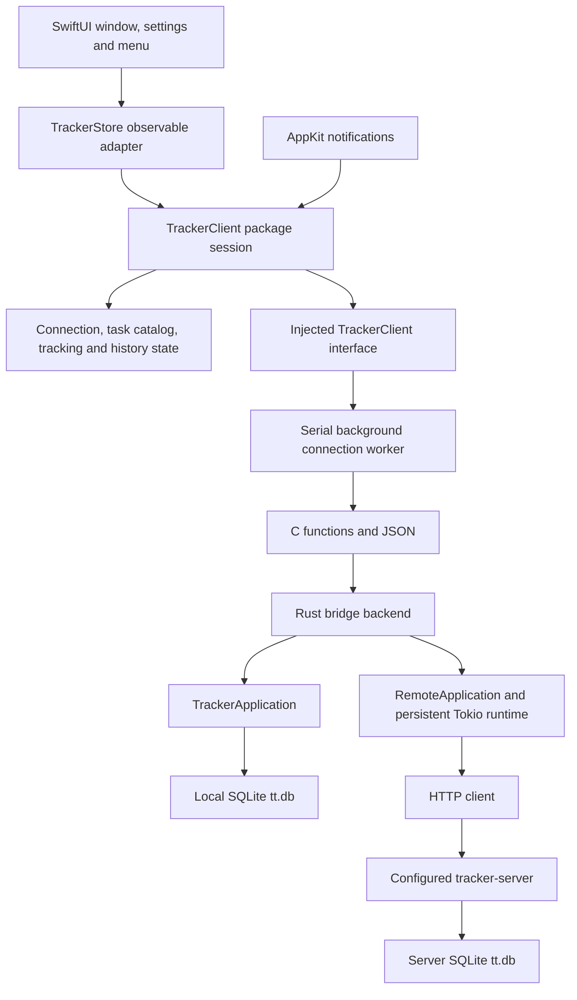

# Native macOS proof of concept

This SwiftUI app shows active and archived tasks, the running timer, and paged worklog history. You can start, switch, and stop tracking. Choose a local database or a tracker server in Connection settings.

## Build and run on a Mac

Use macOS 13 or newer, Xcode 15 or newer, and Rust 1.88 or newer. Open `apps/swiftui/TimeTracker.xcodeproj` in Xcode, select the `TimeTracker` scheme and `My Mac`, then press Run. Xcode builds the Rust library automatically. The build phase finds Rust installed with rustup or mise in their usual locations.

Debug builds use the Mac's active architecture. For a universal Release build, install both Rust targets first:

```sh
rustup target add aarch64-apple-darwin x86_64-apple-darwin
```

Xcode keeps build output in DerivedData. The project signs local builds ad hoc and does not require an Apple Developer account for the current app capabilities.

## Connect to a server

Open Time Tracker > Settings, or click the gear beside the connection status. Choose Server and enter the full HTTP or HTTPS origin, including the server's port. Click Test connection to check it, then Connect to use it. The app saves the successful selection for the next launch. A failed connection change keeps the previous data source and saved settings.

For tabit, use its Tailscale IP and the actual port configured for the tracker server, for example `http://<tabit-tailscale-ip>:<tracker-port>`. The existing server validates the HTTP Host header against its listening address. It rejects a DNS name such as `tabit` unless a reverse proxy rewrites Host to an accepted address. This integration does not change that server policy.

The Mac must be able to reach the server. If the server only listens on loopback, expose it through the project's server deployment setup first. The app checks the server protocol version before loading its tasks.

Local mode uses this Mac's secured default `tt.db`, shared with the local terminal client. Server mode uses only the configured server. Switching modes does not copy or merge their data. An unavailable server never causes a fallback to local storage, and the app does not queue offline writes.

## Tracking

Select an active task and click Start tracking in its details. The button changes to Stop tracking while that task is running. Select another task and click Switch tracking to end the previous worklog and begin the new one at the same instant. Archived tasks cannot start tracking.

Commands capture the selected task, expected running worklog, and UTC time when you click. The server checks its revision and active worklog before accepting a change. If another client changes tracking first, the app reports the conflict and refreshes. A Stop command never stops a replacement worklog.

While a request is running or state is stale, tracking buttons are disabled. If a write fails, the app refreshes authoritative state before allowing another write because the server may already have committed it. During an outage, the app labels its last confirmed state as unavailable. Before the first successful snapshot, the timer displays Unavailable rather than claiming Idle.

## Unit tests

The `TrackerClient` package contains Foundation-only client state and XCTest tests. It has no Rust, SwiftUI, AppKit, database, or network dependency. Run it from the repository root on a Mac or Linux machine with Swift 5.9 or newer:

```sh
swift test --package-path apps/swiftui/TrackerClient
```

The tests use an in-memory settings repository, a manually advanced wall and monotonic clock, a manual scheduler, and an async client whose responses the test controls. They cover connection rollback and persistence, command serialization and captured click times, write reconciliation, selection and pagination, stale history responses, polling, display ticks, sleep/wake, and shutdown.

You can also open `apps/swiftui/TrackerClient/Package.swift` in Xcode and run its package tests. The app remains a native Xcode project and links the local package. Native UI E2E tests are deferred; package tests do not exercise macOS windows, menus, notification delivery, or the rendered appearance.

## Architecture

The Xcode target links a Rust static library through a C bridging header. The app's `TrackerStore` publishes client-session changes on the main actor. A serial background queue owns every bridge operation, JSON decode, and handle release. HTTP requests and database work do not block the UI thread.



A candidate connection must return a valid snapshot before replacing the current backend. The session coordinates operations one at a time. Selection and connection generations prevent older history results from replacing the current selection. The Rust remote backend also blocks writes after failures until an explicit snapshot refresh succeeds.

The package organizes state under `Features/Connection`, `Features/TaskCatalog`, `Features/Tracking`, and `Features/WorklogHistory`. `App/TrackerSession` coordinates them through injected client, clock, scheduler, and settings interfaces. The macOS app organizes its views by the same capabilities. Its `Infrastructure` directory owns Rust bridge calls, real timers, preferences, and AppKit lifecycle notifications. Rust remains responsible for domain rules and persistence.

A session moves once from idle to running, then to stopped on shutdown. A running session distinguishes unconfirmed, confirmed, and stale snapshots. Writes require a confirmed current snapshot and an idle operation gate. Failed writes trigger an authoritative read before another write can proceed. Successful connection changes replace feature state and persist settings; failed changes retain the previous source.

History responses carry the selection generation captured at request time. Timer callbacks carry their scheduling generation. Shutdown invalidates both, cancels scheduled timers, and rejects late results. An already running C call can finish on its queue and release its handle there. Sleep cancels timers while allowing an in-flight operation to finish; wake resets the elapsed anchor and refreshes.

The bridge passes small JSON snapshots and history pages across an in-process function call. Its costs are serialization and decoding, with no separate bridge process or IPC. Server response time and network activity need measurement on a Mac before making battery or latency claims.

## Refresh and battery behavior

The app refreshes state every 5 seconds while a window is visible or an app menu is open. With windows hidden, closed, minimized, or fully covered and menus closed, it refreshes every 60 seconds. The intervals begin after the previous request finishes, so requests cannot overlap.

After connection failures, visible polling backs off to 5, 10, 20, 40, then 60 seconds. Background polling stays at least 60 seconds. A protocol mismatch stops automatic retries until you reopen the UI or click Retry. Opening the UI and waking the Mac request an immediate refresh. Sleep pauses scheduled polling; an already running request may finish.

The elapsed timer redraws once a second only while UI is visible and a timer is active. That tick makes no network request. Timers allow macOS to coalesce wakeups. These rules reduce unnecessary work, but battery impact has not been measured.

## Appearance and history

The app follows macOS light and dark mode. Text, window backgrounds, worklog cards, and borders use system colors. The sidebar keeps macOS's native selection appearance. The task heading stays above the scrolling history and wraps to three lines. Hover over a task name to read its full text.

The Active and Archived tabs remember their selections. Worklogs load 50 at a time. The menu bar clock shows the current task, elapsed time, connection status, and commands to open the window or quit. Closing the window leaves the menu bar item running.

## Check on a Mac

1. Build and run in Xcode. Check readable text in Light and Dark appearance and at the minimum window size.
2. Test and connect to the tracker server on tabit. Confirm its tasks and timer appear. Quit and reopen to confirm the connection setting persists.
3. Start a task, switch to another, then stop it. Confirm history and running state from another client. Change tracking in that client before clicking Stop in the Mac app and confirm the new timer is preserved.
4. Try an invalid or unreachable address in Settings. Confirm Connect keeps the existing connection. Stop the configured server, then confirm stale state is labeled and tracking is disabled. Restart it and confirm recovery.
5. Use a slow connection and change the selected task while history loads. Confirm the window stays responsive and old history cannot replace the new selection.
6. Watch server requests with the window visible, then close or minimize it and keep the menu closed. Confirm the refresh interval changes from about 5 to about 60 seconds. Open the clock menu and confirm it refreshes. Sleep and wake the Mac and confirm the elapsed time includes sleep.
7. Switch to Local, then back to Server. Confirm each data source retains its own tasks and history.

Xcode compilation, native layout, and the lifecycle checks above require a Mac. Foundation package tests can run on Linux. If the build fails, send the error text from Xcode's Report navigator. The Build Rust bridge phase appears separately from Swift compilation and linking.
