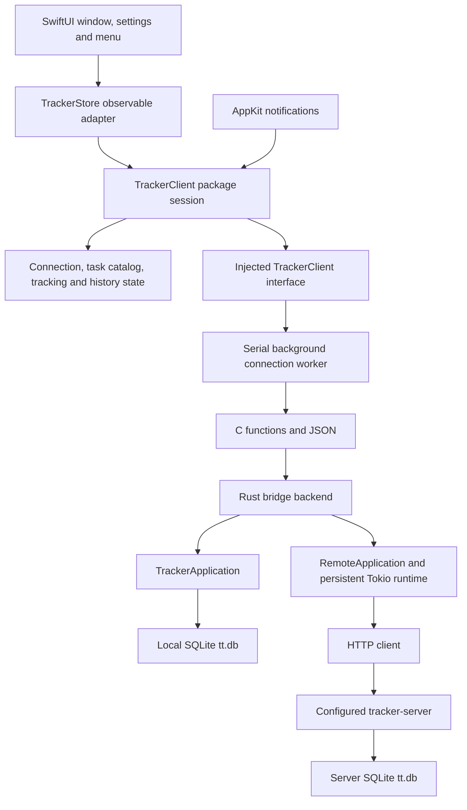

# Native macOS proof of concept

This SwiftUI app shows active and archived tasks, the running timer, and paged worklog history. You can start, switch, and stop tracking. Choose a local database or a tracker server in Connection settings.

## Build and run on a Mac

Use macOS 13 or newer, Xcode 15 or newer, and Rust 1.88 or newer. Open `apps/swiftui/TimeTracker.xcodeproj` in Xcode, select the `TimeTracker` scheme and `My Mac`, then press Run. Xcode builds the Rust library automatically. The build phase finds Rust installed with rustup or mise in their usual locations.

Debug builds use the Mac's active architecture. For a universal Release build, install both Rust targets first:

```sh
rustup target add aarch64-apple-darwin x86_64-apple-darwin
```

Xcode keeps build output in DerivedData. The project signs local builds ad hoc and does not require an Apple Developer account for the current app capabilities.

## Connect to a server

Open Time Tracker > Settings, or click the gear beside the connection status. Choose Server and enter the full HTTP or HTTPS origin, including the server's port. Click Test connection to check it, then Connect to use it. The app saves the successful selection for the next launch. A failed connection change keeps the previous data source and saved settings.

For tabit, use its Tailscale IP and the actual port configured for the tracker server, for example `http://<tabit-tailscale-ip>:<tracker-port>`. The existing server validates the HTTP Host header against its listening address. It rejects a DNS name such as `tabit` unless a reverse proxy rewrites Host to an accepted address. This integration does not change that server policy.

The Mac must be able to reach the server. If the server only listens on loopback, expose it through the project's server deployment setup first. The app checks the server protocol version before loading its tasks.

Local mode uses this Mac's secured default `tt.db`, shared with the local terminal client. Server mode uses only the configured server. Switching modes does not copy or merge their data. An unavailable server never causes a fallback to local storage, and the app does not queue offline writes.

## Tracking

Select an active task and click Start tracking in its details. The button changes to Stop tracking while that task is running. Select another task and click Switch tracking to end the previous worklog and begin the new one at the same instant. Archived tasks cannot start tracking.

Commands capture the selected task, expected running worklog, and UTC time when you click. The server checks its revision and active worklog before accepting a change. If another client changes tracking first, the app reports the conflict and refreshes. A Stop command never stops a replacement worklog.

While a request is running or state is stale, tracking buttons are disabled. If a write fails, the app refreshes authoritative state before allowing another write because the server may already have committed it. During an outage, the app labels its last confirmed state as unavailable. Before the first successful snapshot, the timer displays Unavailable rather than claiming Idle.

## Pause tracking when the screen locks

In Settings > Tracking, enable "Automatically pause tracking when the screen is locked". The preference is off by default and saves immediately for this Mac. It applies to the current data source, including the shared timer when connected to a server.

Locking the screen stops the current worklog at the captured notification time. Unlocking starts a new worklog for the same task after refreshing tracker state, so the locked interval does not count as work. The app resumes only after a confirmed automatic stop and only if tracking is idle and the task is available. Selecting a different task does not change the remembered task.

Disabling the preference, changing the connection, manually changing tracking, or quitting cancels automatic resume. The preference persists across launches; a paused task does not. Failed or uncertain writes require reconciliation, and an idle snapshot alone does not prove that this app paused the task. Errors remain visible instead of claiming that tracking stopped.

The app must remain running to receive lock and unlock events. A locked Mac waking from sleep does not resume until it unlocks. macOS can suspend or lose its network connection before a server write completes; automatic tracking cannot guarantee a successful stop during an outage. The feature uses distributed lock notifications with undocumented names, so notification delivery requires validation on a Mac. It adds requests on transitions and no repeating timer or polling interval.

The server's conditional idle-start guard was also strengthened. Deploy the server update on tabit to use that guard. The HTTP protocol is unchanged.

## Unit tests

The `TrackerClient` package contains Foundation-only client state and XCTest tests. It has no Rust, SwiftUI, AppKit, database, or network dependency. Run it from the repository root on a Mac or Linux machine with Swift 5.9 or newer:

```sh
swift test --package-path apps/swiftui/TrackerClient
```

The tests use an in-memory settings repository, a manually advanced wall and monotonic clock, a manual scheduler, and an async client whose responses the test controls. They cover connection rollback and persistence, command serialization and captured click times, write reconciliation, selection and pagination, stale history responses, polling, display ticks, sleep/wake, and shutdown.

You can also open `apps/swiftui/TrackerClient/Package.swift` in Xcode and run its package tests. The app remains a native Xcode project and links the local package. Native UI E2E tests are deferred; package tests do not exercise macOS windows, menus, notification delivery, or the rendered appearance.

## Coverage and mutation testing

Run these commands from the repository root on Linux or macOS. The scripts require Python 3.12 or newer. Coverage uses the selected Swift toolchain's `llvm-cov`, with `xcrun` as a fallback on macOS:

```sh
python3 scripts/swift-coverage.py
```

The command runs the package tests with instrumentation and requires at least 95% executable source line coverage. It exports `coverage.json`, `lcov.info`, `summary.json`, and `html/index.html` under `.build/swift-coverage`. Tests, generated code, and the native app are outside this report. The protocol-only dependency contract has no executable lines; the script checks its compiler parse tree before listing it separately. Missing coverage for an executable source is an error. Use `--minimum-line-coverage` to choose a stricter minimum.

Build the pinned Muter tool once with Swift 6.1 or newer, then run the mutation check:

```sh
python3 scripts/install-swift-muter.py
python3 scripts/swift-mutations.py
```

The installer downloads public source and dependencies, verifies the source archive checksum, and uses the upstream dependency lockfile. It installs under `.build/swift-tools` without changing system tools. Muter is pinned to revision `7f1f2584e0a27fc05c952a5c8cdd52b10cc9513f`. Compatibility patches supply the missing Linux autorelease-pool function, match reparsed syntax by position and text, insert nested mutations before enclosing ones, and group source mappings by path. These fix upstream defects that reported mutations without inserting them. The runner rejects duplicate source basenames because upstream mutation IDs and log names still use basenames.

Muter's side-effect removal already excludes concurrency primitives such as recursive locks and semaphores. The pinned tool patch adds the missing `NSLock` to that list. Lock acquisition is synchronization, and removing it can cause undefined unlocking behavior or produce a race that sequential tests cannot reliably detect. The package's formatter calls keep their lock; formatter output and timer behavior remain covered by unit tests.

Mutation testing copies only the package manifest, source, and tests into a temporary directory. It runs the unmodified tests first, then applies Muter's operators across production Swift sources. Coverage filtering is disabled so uncovered mutation points also run. Baseline and mutant tests use four isolated XCTest workers. Each mutant has a 180-second test timeout to allow the suite's bounded failure waits to finish on slower machines. The runner limits the baseline to 180 seconds and the full Muter process to 1,800 seconds; use `--timeout` to change the latter. Timeout or interruption stops compiler and test descendants before removing temporary files.

Surviving, timed-out, skipped, or failed-to-build mutants fail the command. An unexplained runtime error also fails; accepting a crash as a killed mutant requires a matching test log with evidence that a test started and crashed. A missing, empty, or inconsistent report fails. The mutation score alone does not decide success. Unit fixtures bound asynchronous waits so removed callbacks fail promptly.

Results and logs go to `.build/swift-mutations`, including individual test logs under `test-logs` when Muter fails or times out. A focused diagnostic run accepts package-relative source paths:

```sh
python3 scripts/swift-mutations.py --files Sources/TrackerClient/Features/Connection/ConnectionState.swift
```

Focused runs label their scope and do not replace a full package check. All commands accept `--swift` for a specific toolchain. Coverage also accepts `--llvm-cov`; mutation testing accepts `--muter` for another tool binary. Generated artifacts are ignored by Git.

These checks cover the portable client state. Native UI E2E tests will run on macOS and remain deferred. Rust coverage, mutation testing, and CRAP checks continue to cover the Rust application and bridge separately.

## Architecture

The Xcode target links a Rust static library through a C bridging header. The app's `TrackerStore` publishes client-session changes on the main actor. A serial background queue owns every bridge operation, JSON decode, and handle release. HTTP requests and database work do not block the UI thread.



A candidate connection must return a valid snapshot before replacing the current backend. The session coordinates operations one at a time. Selection and connection generations prevent older history results from replacing the current selection. The Rust remote backend also blocks writes after failures until an explicit snapshot refresh succeeds.

The package organizes state under `Features/Connection`, `Features/TaskCatalog`, `Features/Tracking`, and `Features/WorklogHistory`. `App/TrackerSession` coordinates them through injected client, clock, scheduler, and settings interfaces. The macOS app organizes its views by the same capabilities. Its `Infrastructure` directory owns Rust bridge calls, real timers, preferences, and AppKit lifecycle notifications. Rust remains responsible for domain rules and persistence.

A session moves once from idle to running, then to stopped on shutdown. A running session distinguishes unconfirmed, confirmed, and stale snapshots. Writes require a confirmed current snapshot and an idle operation gate. Failed writes trigger an authoritative read before another write can proceed. Successful connection changes replace feature state and persist settings; failed changes retain the previous source.

History responses carry the selection generation captured at request time. Timer callbacks carry their scheduling generation. Shutdown invalidates both, cancels scheduled timers, and rejects late results. An already running C call can finish on its queue and release its handle there. Sleep cancels timers while allowing an in-flight operation to finish; wake resets the elapsed anchor and refreshes.

The bridge passes small JSON snapshots and history pages across an in-process function call. Its costs are serialization and decoding, with no separate bridge process or IPC. Server response time and network activity need measurement on a Mac before making battery or latency claims.

## Refresh and battery behavior

The app refreshes state every 5 seconds while a window is visible or an app menu is open. With windows hidden, closed, minimized, or fully covered and menus closed, it refreshes every 60 seconds. The intervals begin after the previous request finishes, so requests cannot overlap.

After connection failures, visible polling backs off to 5, 10, 20, 40, then 60 seconds. Background polling stays at least 60 seconds. A protocol mismatch stops automatic retries until you reopen the UI or click Retry. Opening the UI and waking the Mac request an immediate refresh. Sleep pauses scheduled polling; an already running request may finish.

The elapsed timer redraws once a second only while UI is visible and a timer is active. That tick makes no network request. Timers allow macOS to coalesce wakeups. These rules reduce unnecessary work, but battery impact has not been measured.

## Appearance and history

The app follows macOS light and dark mode. Text, window backgrounds, worklog cards, and borders use system colors. The sidebar keeps macOS's native selection appearance. The task heading stays above the scrolling history and wraps to three lines. Hover over a task name to read its full text.

The Active and Archived tabs remember their selections. Worklogs load 50 at a time. The menu bar clock shows the current task, elapsed time, connection status, and commands to open the window or quit. Closing the window leaves the menu bar item running.

## Check on a Mac

1. Build and run in Xcode. Check readable text in Light and Dark appearance and at the minimum window size.
2. Test and connect to the tracker server on tabit. Confirm its tasks and timer appear. Quit and reopen to confirm the connection setting persists.
3. Start a task, switch to another, then stop it. Confirm history and running state from another client. Change tracking in that client before clicking Stop in the Mac app and confirm the new timer is preserved.
4. Try an invalid or unreachable address in Settings. Confirm Connect keeps the existing connection. Stop the configured server, then confirm stale state is labeled and tracking is disabled. Restart it and confirm recovery.
5. Use a slow connection and change the selected task while history loads. Confirm the window stays responsive and old history cannot replace the new selection.
6. Watch server requests with the window visible, then close or minimize it and keep the menu closed. Confirm the refresh interval changes from about 5 to about 60 seconds. Open the clock menu and confirm it refreshes. Sleep and wake the Mac and confirm the elapsed time includes sleep.
7. Switch to Local, then back to Server. Confirm each data source retains its own tasks and history.
8. Enable automatic pause in Settings > Tracking, start a task, lock the Mac for about 30 seconds, then unlock it. Confirm the same task resumes in a new worklog and the locked interval is excluded. Repeat with the app window closed and with lock followed by sleep. Wake while still locked and confirm tracking remains paused. Start a timer from another client before unlocking and confirm the Mac preserves it. Disable the setting and confirm locking leaves tracking unchanged.

Xcode compilation, native layout, and the lifecycle checks above require a Mac. Foundation package tests can run on Linux. If the build fails, send the error text from Xcode's Report navigator. The Build Rust bridge phase appears separately from Swift compilation and linking.
