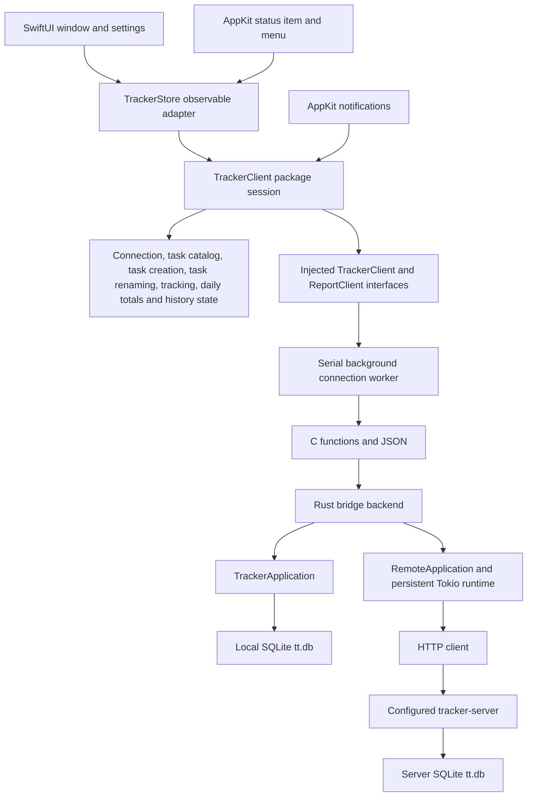

# Native macOS proof of concept

This SwiftUI app shows active and archived tasks, the running timer, and paged worklog history. You can create tasks and start, switch, and stop tracking. Choose a local database or a tracker server in Connection settings.

## Build and run on a Mac

Use macOS 15 or newer, Xcode with the macOS 27 SDK or newer, and Rust 1.88 or newer. Open `apps/swiftui/TimeTracker.xcodeproj` in Xcode, select the `TimeTracker` scheme and `My Mac`, then press Run. Xcode builds the Rust library automatically. The build phase finds Rust installed with rustup or mise in their usual locations.

Debug builds use the Mac's active architecture. For a universal Release build, install both Rust targets first:

```sh
rustup target add aarch64-apple-darwin x86_64-apple-darwin
```

Xcode keeps build output in DerivedData. The project signs local builds ad hoc and does not require an Apple Developer account for the current app capabilities.

## Connect to a server

Open Time Tracker > Settings, or click the gear in the sidebar header. Choose Server and enter the full HTTP or HTTPS origin, including the server's port. Click Test connection to check it, then Connect to use it. The app saves the successful selection for the next launch. A failed connection change keeps the previous data source and saved settings.

For tabit, use its Tailscale IP and the actual port configured for the tracker server, for example `http://<tabit-tailscale-ip>:<tracker-port>`. The existing server validates the HTTP Host header against its listening address. It rejects a DNS name such as `tabit` unless a reverse proxy rewrites Host to an accepted address. This integration does not change that server policy.

The Mac must be able to reach the server. If the server only listens on loopback, expose it through the project's server deployment setup first. The app checks the server protocol version before loading its tasks.

Local mode uses this Mac's secured default `tt.db`, shared with the local terminal client. Server mode uses only the configured server. Switching modes does not copy or merge their data. An unavailable server never causes a fallback to local storage, and the app does not queue offline writes.

## Create a task

In the main window, click the plus button in the sidebar header. You can also right-click the task list and choose New task, or choose File > New task with Command-N. Each opens the same dialog. Command-N reveals a tracker window if only Settings is open or all tracker windows are closed. Enter a name and click Create. The app selects the confirmed task in Active and loads its history. Creating a task leaves any running timer unchanged. Task creation is available in local and server mode.

The sheet keeps the draft in memory. Rust validates the name and creates its permanent UUID before submitting it to the configured backend. SQLite stores that UUID as the task's primary key. Names may repeat; IDs must be unique. Names must contain text, cannot contain control characters, and cannot exceed 256 Unicode scalars.

Create is disabled during submission. Validation and request errors appear in the sheet. If a server write has an uncertain outcome, the app retains the submitted name, ID, and timestamp for Retry. It checks authoritative state before sending another creation request, so a lost response does not create a second task. Connection changes are blocked until this creation is resolved. You can close and reopen the sheet to retry, but quitting loses the pending intent. This is an in-memory recovery flow and does not queue offline writes.

## Edit a task name

Select a task and click the pencil in the toolbar, or right-click a task and choose Edit name. Right-click editing captures that task even when another task is selected. The dialog starts with the current name. Save updates that task in local or server mode, including active and archived tasks. Its ID, archive state, running timer, and worklog timestamps and durations stay unchanged. The new name appears in the sidebar, task details, timer, and menu. An open menu keeps its captured name until it closes; reopening shows the confirmed name.

The dialog captures the task you clicked and keeps its draft through background refreshes. Before saving, the app refreshes authoritative state. If that read shows another client changed the task's name, it asks you to cancel and reopen the dialog to review the change. Server mode also checks the tracker revision when applying the write. Local mode retains the shared SQLite database's existing last-write behavior: a direct database client can still rename between the preflight read and the write.

Validation errors appear inline. Save is disabled during submission. An uncertain response retains the original target, name, and timestamp for Retry, and blocks changing connections until the outcome is resolved. If a fresh snapshot already confirms the requested name, the app completes without sending another rename. Pending recovery is kept in memory and does not survive quitting. Creation and renaming use one dialog at a time.

## Archive and unarchive tasks

Use the archive button in the detail toolbar, or right-click an active task and choose Archive task. Confirm the task name before archiving. Its worklog history stays available in Archived. Stop tracking before archiving the running task; Rust also rejects archiving if another client starts its timer while the confirmation is open.

In Archived, use the toolbar or context menu to Unarchive task. Unarchiving runs immediately and does not start tracking. Both actions keep the current tab and preserve selection when changing another task. If the selected task leaves the tab, the app selects a remaining task. The restored task is remembered for the next switch to Active.

The command captures the clicked task, action, and timestamp and refreshes authoritative state before writing. A changed task name requires review. Errors appear in the task action dialog. An uncertain write retains its original request and checks the current archive state before Retry, so an already confirmed outcome does not submit again. Connection changes and other editors wait until the request is resolved. Pending recovery stays in memory and does not survive quitting.

Dialog contents stay stable during dismissal. If an Unarchive request fails after the tracker window closes, the error stays pending. Reopen the tracker and use Review task action in the toolbar to resolve it.

## Archive inactive tasks

Use Archive inactive tasks in the sidebar toolbar to open the bulk archive dialog. The inactivity period starts at 14 days. Enter another positive whole number of days to load a new preview. The dialog lists every eligible task and disables confirmation until the current preview has finished loading.

Rust applies the same eligibility rules in local and server mode. A task must be active, created and last updated before the cutoff, and have no positive-duration work ending after the cutoff. Running tasks are always excluded. Days mean consecutive 24-hour periods before the captured preview time. Tasks hidden by the sidebar's current filter are included.

Confirmation archives all currently eligible tasks for the displayed period. Local storage rechecks the preview's candidate IDs atomically. Server mode uses the preview's revision and recomputes eligibility at confirmation without a candidate fingerprint. The result reports the actual archived count. Worklog history and the running session remain available.

Changing the period or cancelling discards the preview. A failed confirmation requires a fresh preview before another submission. An uncertain response triggers a state refresh and never automatically repeats the archive command. Connection changes and other editors wait while the dialog owns the interaction. Dialog contents remain stable during dismissal.

The configurable operation uses additional server endpoints and requires a server built with this feature. The existing protocol version and fixed 14-day TUI commands remain compatible. The TUI does not gain a configurable period.

## Edit worklog times

Open the actions menu on a worklog card, or right-click the card, and choose Edit times. The sheet shows local dates and times and the time zone used. Completed worklogs expose Start and End with a duration preview. Running worklogs expose Start only and keep tracking after saving. Archived-task history supports the same editor.

Changed fields use minute precision. Unchanged fields preserve their stored seconds and fractions. Save rejects future timestamps, an end before the start, and overlapping worklogs for the same task. Errors stay in the sheet with the draft. Enter saves and Escape cancels.

The command sends the original timestamps alongside their replacements. The database checks those originals inside the update transaction, so another client's correction or stop cannot be overwritten. A conflict keeps the draft and asks you to review the latest entry before retrying. A lost response retains the submitted values for reconciliation. Connection changes are blocked while a save is unresolved. Successful edits refresh history, daily totals, and task ordering, and a changed running start resets the elapsed timer.

## Move worklogs

Choose Move to task from a worklog's actions menu or context menu. Search destination tasks by typing part of a name; matching ignores case and accepts non-adjacent characters, like the TUI. Results contain active tasks other than the worklog's source task, ordered by recent activity. Arrow keys select a destination while searching, Return moves, and Escape cancels.

Moving preserves the worklog's identity and exact timestamps. A running worklog keeps running on its destination task. The command checks the original task and timestamps before writing, and rejects overlaps or an unavailable destination. Errors stay in the dialog with the search and selection. An uncertain response retains the original move for reconciliation; Retry first checks whether the move already committed. Connection changes and other editors are blocked until that outcome is resolved. Pending recovery does not survive quitting.

Destination search uses the client's cached Rust task snapshot, without database or server requests for each keystroke. Opening the dialog refreshes the snapshot. Successful moves refresh history, task state, and daily totals while keeping the selected task. Dialog contents stay stable throughout dismissal.

## Tracking

Select an active task and click the play icon in the toolbar. The icon changes to stop while that task is running. Select another task and click play to end the previous worklog and begin the new one at the same instant. Archived tasks cannot start tracking.

The menu bar popup also controls tracking. Click an active task in Today to start it or switch to it. Expand Start tracking for active tasks with no time logged today. The running task has a filled colored dot and a bold name; clicking it stops its captured worklog. Its submenu also offers Stop tracking. These actions leave the window's task selection unchanged. Archived entries show their totals and cannot start tracking.

Commands capture the selected task, expected running worklog, and UTC time when you click. The server checks its revision and active worklog before accepting a change. If another client changes tracking first, the app reports the conflict and refreshes. A Stop command never stops a replacement worklog.

Background refreshes keep tracking and connection controls enabled. A click during a read captures its target and time, then waits for that read to finish. Tracking commands check the refreshed state before running; a changed timer or unavailable task produces an error rather than applying the click to another target. Controls are disabled while a user command is queued or running, or tracking state is stale. Sleep and shutdown cancel queued commands. If a write fails, the app refreshes authoritative state before allowing another write because the server may already have committed it. During an outage, the app labels its last confirmed state as unavailable. Before the first successful snapshot, the timer displays Unavailable rather than claiming Idle.

## Menu bar clicks and task colors

Right-click the menu bar dot to open its menu. Control-click also opens it. Left-click stops the current worklog, or starts the last tracked task when idle. If there is no previous task or that task was deleted or archived, left-click opens the menu. Click decisions use live confirmed state and the existing serialized commands. Busy, stale, sleeping, locked, or stopped sessions reject tracking clicks. The displayed dot never grants write permission.

The dot is filled while tracking and outlined while idle. Both use the current or last tracked task's color. Task entries in Today and Start tracking show their own colored dots, including when macOS hides optional menu images. An unavailable connection shows an outline and labels the task as last confirmed. Hover shows the running task's name, the last tracked task when idle, or that no task has been tracked yet. Tooltips resolve names from the current catalog, so renaming is reflected there too.

Task colors use a fixed palette selected by a stable hash of the permanent task ID. Sidebar rows and menu entries share the same mapping. Colors remain stable across restarts and devices; different tasks can share a palette color. System colors adapt to Light and Dark appearance. The last tracked task ID is saved on this Mac separately for each server URL and for the local database. It changes only from accepted snapshots. A newer completed worklog reported by another client can update the last task even when its running state was never observed.

The native AppKit status-item controller owns mouse events, tooltip, appearance updates, and menu presentation. It creates one menu snapshot per opening and holds it across the complete popup tracking loop. It reuses the portable session for tracking and does not add a network poll or display timer. Its subscriptions and status item are removed when the app terminates.

## Pause tracking when the screen locks

In Settings > Tracking, enable "Automatically pause tracking when the screen is locked". The preference is off by default and saves immediately for this Mac. It applies to the current data source, including the shared timer when connected to a server.

Locking the screen stops the current worklog at the captured notification time. Unlocking starts a new worklog for the same task after refreshing tracker state, so the locked interval does not count as work. The app resumes only after a confirmed automatic stop and only if tracking is idle and the task is available. Selecting a different task does not change the remembered task.

Disabling the preference, changing the connection, manually changing tracking, or quitting cancels automatic resume. The preference persists across launches; a paused task does not. Failed or uncertain writes require reconciliation, and an idle snapshot alone does not prove that this app paused the task. Errors remain visible instead of claiming that tracking stopped.

The app must remain running to receive lock and unlock events. A locked Mac waking from sleep does not resume until it unlocks. macOS can suspend or lose its network connection before a server write completes; automatic tracking cannot guarantee a successful stop during an outage. The feature uses distributed lock notifications with undocumented names, so notification delivery requires validation on a Mac. It adds requests on transitions and no repeating timer or polling interval.

The server's conditional idle-start guard was also strengthened. Deploy the server update on tabit to use that guard. The HTTP protocol is unchanged.

## Today's totals

Each sidebar task shows its time logged today. The menu's Today section lists tasks with time logged today, including archived tasks, and shows the combined total with seconds. The status bar shows that combined total in hours and minutes beside the tracking icon. A `~` prefix marks cached totals; `-` means the total is unavailable. Totals include the running worklog and only the portion of an overnight worklog that overlaps today.

Today follows the Mac's local calendar and time zone. Calendar boundaries account for daylight saving changes. A missing report shows an unavailable value instead of zero; failed updates label retained totals as cached. Connecting to a different data source clears the previous totals.

Settings > Menu bar > Show today's total next to the icon controls the status bar total. It is enabled by default, applies immediately, and is saved on this Mac. Turn it off to show just the tracking icon. The Today section inside the menu still shows the total. Hiding the status bar total stops its minute display clock.

The Rust application report query aggregates the full day independently of paged worklog history. Its response includes totals and an authoritative tracker snapshot from the same read. Healthy synchronization uses this report instead of a separate snapshot request. Swift advances the matching running worklog's contribution locally between reports. Ordinary display ticks make no network request. One local day-boundary timer clears yesterday's totals and requests today's report, even while tracking is idle.

## Menu navigation and task actions

Settings > Menu shortcut lets you record the global Open menu binding. Click the binding and press its new keys; Escape cancels. Valid changes apply immediately and save on this Mac. Restore default shortcut resets it to Control-Option-T. The binding needs Command, Control, or Option. If macOS cannot register it, Settings shows the error and keeps the previous binding. Bindings follow keyboard layout changes when the new layout can provide the chosen key.

Control-Option-T opens the native menu-bar menu from any app while Time Tracker is running. Right-clicking the status icon opens the same menu. AppKit positions the popup below the menu bar. Primary clicks on the icon keep their existing tracking action. Up and Down navigate the menu, Left and Right open and close its submenus, Return invokes the highlighted action, and Escape closes the menu. Navigation and copying have no custom shortcuts.

Every task in Today or Start tracking has a submenu containing Start tracking or Stop tracking, Copy task name, Copy exact duration, and Copy rounded duration. Hover over a task or press Right to open its submenu. Clicking an eligible task row itself starts tracking, or stops that task's captured worklog when it is running. Archived and unavailable tasks still offer copy operations, while tracking is disabled.

The menu header shows connection status and the configured server URL on one row in server mode. The active task and its elapsed time share another row. The Today section shows Total with its duration aligned right, followed by a separator above the task list. Long names and URLs truncate in the menu; hover to read their full text.

Elapsed time, the combined total, and durations for tasks already shown in Today update while the menu is open. The existing clock updates text in place; it makes no additional request. Task order, menu items, action targets, and submenus stay fixed until closing. Time fields use monospaced digits and reserve width before opening. If another client replaces or stops the captured timer, its elapsed field shows Unavailable. Changing the data source makes the old menu's values unavailable until reopening. Cached totals use `~` and their hover text explains the current state.

Exact duration uses the TUI format, such as `1h 23m 45s`; rounded duration uses the nearest 15 minutes, such as `1h 30m`. Both use today's total for the task whose submenu supplied the command. Copying reads the current total when invoked, including a running worklog's contribution. The displayed task list stays stable while open. Cached values can be copied, and the menu labels cached totals. Unavailable copy commands are disabled; if a value becomes unavailable after opening the menu, invoking its command leaves the clipboard unchanged and sounds an alert. Confirmed empty totals copy `0s` or `0m`. Stop commands capture the worklog ID so they cannot stop a replacement worklog. Tracking and copy commands capture the data source and task identity. Commands use normal native menu dismissal.

Native interaction checks require a Mac. Open the menu with the global shortcut and with a right-click. Check the popup starts below the menu bar on each display, with the menu bar always visible and with automatic hiding enabled. Use arrows to navigate Today and Start tracking, open a task submenu with Right, and invoke every command with Return. Hover to open the same submenus. Click an idle task row directly and confirm it starts; click the running task row directly and confirm it stops. Repeat with its submenu already visible. Copy a task name, exact duration, and rounded duration from both task lists, including an archived task, confirmed zero totals, cached state, and a running task after leaving the menu open for a minute. Confirm unavailable tracking and copy commands are disabled. Change tracking from another client while the menu is open and confirm a captured Stop command cannot stop the replacement worklog. Close with Escape or an outside click, then confirm a primary click on the status icon still starts or stops tracking. Record another Open menu binding, restart to verify persistence, check a global registration conflict, and switch keyboard layouts.

## Unit tests

The `TrackerClient` package contains Foundation-only client state and XCTest tests. It has no Rust, SwiftUI, AppKit, database, or network dependency. Run it from the repository root on a Mac or Linux machine with Swift 5.9 or newer:

```sh
swift test --package-path apps/swiftui/TrackerClient
```

The tests use an in-memory settings repository, a manually advanced wall and monotonic clock, a manual scheduler, and an async client whose responses the test controls. They cover connection rollback and persistence, command serialization and captured click times, task creation and renaming, write reconciliation, selection and pagination, stale history responses, polling, display ticks, sleep/wake, and shutdown.

You can also open `apps/swiftui/TrackerClient/Package.swift` in Xcode and run its package tests. The app remains a native Xcode project and links the local package. Package tests do not exercise macOS windows, menus, notification delivery, or the rendered appearance.

## Native UI end-to-end tests

On a Mac with Xcode selected and an active desktop session, run:

```sh
apps/swiftui/check-native-ui.sh
```

The helper builds `tt-cli` and `tt`, then runs the `TimeTrackerUITests` target in the Debug app. Each test uses a fresh SQLite database and an isolated preferences suite. Server cases start a real `tt` server; an ordered fault proxy exercises delays, outages, and uncertain writes. The CLI creates fixtures and verifies stored results while UI actions call the production Swift-to-Rust bridge.

The suite covers task creation, selection, tracking, history, rename, archive, correction, move, connection recovery, native menus, clipboard actions, settings, windows, totals, lifecycle delivery, and appearance. The seven original bulk archive scenarios are retained. See the [coverage map and dedicated-Mac acceptance checklist](e2e-coverage.md) for the cases and remaining platform evidence.

Use `--smoke` for launch checks or `--group core`, `tasks`, `worklogs`, `server`, `menu`, or `mac` for a focused run. CI requires all six groups, each running serially on its own desktop. It retains logs and result bundles in `native-macos-diagnostics-<group>` artifacts, including after failure. Open the result bundle in Xcode to inspect screenshots and accessibility diagnostics.

The runner forwards absolute CLI, server, proxy, and Python paths using `TEST_RUNNER_` environment variables. UI automation may request permission on your first local run. Allow Xcode to control the desktop when macOS asks. Native tests require an active desktop session; real lock, sleep, multiple-display, and keyboard-layout acceptance checks require a dedicated Mac.

On a Mac with Xcode selected, run the SwiftUI scene layout checks from the repository root:

```sh
apps/swiftui/check-native-layout.sh
```

This check compiles the production `TrackerSplitLayout` without the Rust bridge or a server. A SwiftUI `App` and `WindowGroup` create two fixture windows. It checks that task headings and connection footers stay outside the window chrome at two window sizes, with compact and expanded toolbars and changes in toolbar visibility. It also hides and restores one sidebar, checks that detail width follows the change, and confirms that the other window keeps its layout. It requires a macOS desktop session and cannot run on Linux. It checks the shared split layout, not the complete app. Build the app and use the manual checks below to validate command routing, Settings, and dialog ownership.

## Coverage and mutation testing

Run these commands from the repository root on Linux or macOS. The scripts require Python 3.12 or newer. Coverage uses the selected Swift toolchain's `llvm-cov`, with `xcrun` as a fallback on macOS:

```sh
python3 scripts/swift-coverage.py
```

The command runs the package tests with instrumentation and requires at least 95% executable source line coverage. It exports `coverage.json`, `lcov.info`, `summary.json`, and `html/index.html` under `.build/swift-coverage`. Tests, generated code, and the native app are outside this report. The protocol-only dependency contract has no executable lines; the script checks its compiler parse tree before listing it separately. Missing coverage for an executable source is an error. Use `--minimum-line-coverage` to choose a stricter minimum.

Build the pinned Muter tool once with Swift 6.1 or newer, then run the mutation check:

```sh
python3 scripts/install-swift-muter.py
python3 scripts/swift-mutations.py
```

The installer downloads public source and dependencies, verifies the source archive checksum, and uses the upstream dependency lockfile. It installs under `.build/swift-tools` without changing system tools. Muter is pinned to revision `7f1f2584e0a27fc05c952a5c8cdd52b10cc9513f`. Compatibility patches supply the missing Linux autorelease-pool function, match reparsed syntax by position and text, insert nested mutations before enclosing ones, and group source mappings by path. These fix upstream defects that reported mutations without inserting them. The runner rejects duplicate source basenames because upstream mutation IDs and log names still use basenames.

Muter's side-effect removal already excludes concurrency primitives such as recursive locks and semaphores. The pinned tool patch adds the missing `NSLock` to that list. Lock acquisition is synchronization, and removing it can cause undefined unlocking behavior or produce a race that sequential tests cannot reliably detect. The package's formatter calls keep their lock; formatter output and timer behavior remain covered by unit tests.

Mutation testing copies only the package manifest, source, and tests into a temporary directory. It runs the unmodified tests first, then applies Muter's operators across production Swift sources. Coverage filtering is disabled so uncovered mutation points also run. Baseline and mutant tests use four isolated XCTest workers. Each mutant has a 180-second test timeout to allow the suite's bounded failure waits to finish on slower machines. The runner limits the baseline to 180 seconds and the full Muter process to 1,800 seconds; use `--timeout` to change the latter. Timeout or interruption stops compiler and test descendants before removing temporary files.

Surviving, timed-out, skipped, or failed-to-build mutants fail the command. An unexplained runtime error also fails; accepting a crash as a killed mutant requires a matching test log with evidence that a test started and crashed. A missing, empty, or inconsistent report fails. The mutation score alone does not decide success. Unit fixtures bound asynchronous waits so removed callbacks fail promptly.

Results and logs go to `.build/swift-mutations`, including individual test logs under `test-logs` when Muter fails or times out. For task handoffs, select affected production files using package-relative source paths:

```sh
python3 scripts/swift-mutations.py --files Sources/TrackerClient/Features/Connection/ConnectionState.swift
```

Focused runs label their scope and satisfy the handoff requirement under the scope rules in `AGENTS.md`. Include production files exercised by changed tests and run the full package when the affected files cannot be identified. Documentation-only changes skip mutation checks. Routine full mutation runs are deferred until CI is set up.

All commands accept `--swift` for a specific toolchain. Coverage also accepts `--llvm-cov`; mutation testing accepts `--muter` for another tool binary. Generated artifacts are ignored by Git.

These checks cover the portable client state. The native UI end-to-end suite exercises local and server workflows on macOS through the real Rust bridge. Rust coverage, mutation testing, and CRAP checks cover the Rust application and bridge separately.

## Architecture

The Xcode target links a Rust static library through a C bridging header. The app's `TrackerStore` publishes changed content on the main actor. `TrackerPresentationObserver` compares content, request controls, task creation, formatted elapsed time, and daily totals separately. The creation sheet, timer labels, daily totals, and request controls have their own observable adapters, so draft edits, clock ticks, and unchanged server polls do not invalidate the task and worklog lists. A serial background queue owns every bridge operation, JSON decode, and handle release. HTTP requests and database work do not block the UI thread.



A candidate connection must return a valid snapshot before replacing the current backend. The session coordinates operations one at a time. Selection and connection generations prevent older history results from replacing the current selection. The Rust remote backend also blocks writes after failures until an explicit snapshot refresh succeeds.

The package organizes state under `Features/Connection`, `Features/TaskCatalog`, `Features/TaskCreation`, `Features/TaskRename`, `Features/Tracking`, `Features/DailyTotals`, and `Features/WorklogHistory`. `App/TrackerSession` coordinates them through injected client, clock, scheduler, and settings interfaces. Shared task name editing rules live under `Features/TaskEditing`. `Features/TaskIndicators` owns the deterministic color and dot presentation, and `Features/MenuBar` owns remembered-task state and menu snapshot presentation. The remembered-task repository stores identifiers without duplicating tasks or worklogs. The macOS app organizes its views by the same capabilities and shares the name form between creation and renaming. Its `Infrastructure` directory owns Rust bridge calls, real timers, preferences, and AppKit lifecycle notifications. Rust remains responsible for domain rules and persistence.

`App/TimeTrackerApp` declares tracker windows and Settings as SwiftUI scenes. Tracker windows have UUID values so `openWindow(id:value:)` can reveal an existing scene. `App/TrackerApplicationMenus` defines task, window, and Settings commands through SwiftUI `Commands`; SwiftUI supplies the standard application and text editing menus. A stable `TrackerAppRuntime` retains the shared store independently of any window. It does not publish ordinary session updates to the scene tree.

`App/TrackerWindow` presents the existing sidebar and detail views through `App/TrackerSplitLayout`, a SwiftUI `NavigationSplitView`. Each window keeps its own column visibility. SwiftUI owns the split divider, sidebar toggle, toolbar, and content safe areas. Settings and New Task use SwiftUI toolbar buttons; editing and tracking actions belong to the detail toolbar. The task name appears in the fixed detail heading above the scrolling worklog cards. Toolbar controls observe request and editor state separately from the list and history views.

The app requires macOS 15 for SwiftUI window dismissal controls. The gear and Command-comma open the same named SwiftUI Settings window through `openWindow`. File > New Window, Command-Shift-N, creates another UUID tracker scene with independent sidebar layout and the shared session. Command-N reveals an existing tracker window or requests a new scene before presenting task creation. Closing all tracker windows leaves tracking and the status item running; Dock, Spotlight, and the status menu can reveal or reopen a tracker window.

`App/TrackerTaskPresentationCoordinator` routes creation, rename, and tracking errors to one UUID scene. Other windows cannot present or cancel the same editor. `TrackerWindowRoutingState` tracks scene identities, activity, preferred ownership, and pending open requests without native window references. SwiftUI `windowDismissBehavior` prevents closing the owner while an editor or alert is presented. Ownership persists through scene inactivity. Unowned tracking errors remain in the status menu until a tracker scene becomes active; errors never create or reveal a hidden window.

AppKit remains at macOS integration points. `MacLifecycleObserver` receives sleep, wake, and precise window visibility notifications, while Foundation distributed notifications report screen lock and unlock. The application delegate handles reopening and termination; native calls activate or quit the app. `TrackerStatusItemController` owns the AppKit status item, colored icon, mouse actions, and native menu. Window creation, layout, close controls, in-window task dots, and appearance styles belong to SwiftUI.

SwiftUI chooses toolbar spacing and grouping from the declared placements. The controls may not match the previous AppKit toolbar pixel for pixel, and their appearance can vary between macOS releases. Validate the layout, window reopening, Settings, and dialog ownership on a Mac before relying on the migration. Rust and portable client checks do not validate native SwiftUI scenes.

A session moves once from idle to running, then to stopped on shutdown. A running session distinguishes unconfirmed, confirmed, and stale snapshots. The request gate permits one operation at a time. Background reads leave controls available, while an accepted user command reserves the next operation and blocks duplicate clicks. Queued tracking commands retain their task or worklog ID and click timestamp, then check authoritative state before writing. A queued command behind a history read obtains a snapshot first because history alone does not confirm active tracking. Failed writes trigger an authoritative read before another write can proceed. Successful connection changes replace feature state and persist settings; failed changes retain the previous source.

History responses carry the selection generation captured at request time. Timer callbacks carry their scheduling generation. Shutdown invalidates both, cancels scheduled timers, and rejects late results. An already running C call can finish on its queue and release its handle there. Sleep cancels timers while allowing an in-flight operation to finish; wake resets the elapsed anchor and refreshes.

Task totals have one stable presentation adapter per task ID. The portable observer compares each formatted value and explanation, then notifies only changed IDs. Updating a running or server-refreshed total leaves completed task rows untouched. A cache-status change updates every affected tooltip. Routine synchronization does not show the connection spinner; it appears only during an explicit connection change. Activity notifications follow the state that blocks controls, so unchanged polls do not flash buttons disabled and enabled.

Refreshing history for the same task retains its rows and pagination cursor until the replacement page arrives. Selecting another task or connecting to another data source clears that history immediately. Rows stay visible during synchronization without displaying another task's cached rows.

The bridge passes JSON snapshots, daily reports, and history pages across an in-process function call. Its costs are serialization and decoding, with no separate bridge process or IPC. Server response time and network activity need measurement on a Mac before making battery or latency claims.

## Refresh and battery behavior

The app refreshes state every 5 seconds while a window is visible or an app menu is open. With windows hidden, closed, minimized, or fully covered and menus closed, it refreshes every 60 seconds. The intervals begin after the previous request finishes, so requests cannot overlap.

The native menu uses a separate immutable presentation snapshot. The controller holds it through the synchronous [AppKit popup tracking loop](https://developer.apple.com/documentation/appkit/nsmenu/popup(positioning:at:in:)), including nested menus. Elapsed labels, task totals, action availability, and the status bar label stay fixed while the menu is open, and the controller keeps the same native menu items during navigation. Tracking, polling, and the window's timers continue. Closing the menu publishes the latest state; opening it captures fresh values. Commands still validate task eligibility and the captured worklog ID against the live session. The status label compares only its displayed minutes and tracking status, so second ticks do not redraw it. The app owns its adapters without observing session changes at the scene level.

After connection failures, visible polling backs off to 5, 10, 20, 40, then 60 seconds. Background polling stays at least 60 seconds. A protocol mismatch stops automatic retries until you reopen the UI or click Retry. Opening the UI and waking the Mac request an immediate refresh. Sleep pauses scheduled polling; an already running request may finish.

The elapsed timer redraws once a second only while UI is visible and a timer is active. That tick makes no network request. The daily totals adapter owns a separate one-minute clock while tracking runs and the status bar total is enabled, so the status bar total advances when windows and menus are closed. It reads the locally advancing total and does not enable foreground polling or the session's one-second display timer. The minute clock stops when tracking is idle and allows five seconds of tolerance for macOS to coalesce wakeups. These rules reduce unnecessary work, but battery impact has not been measured.

## Appearance and history

The app follows macOS light and dark mode through SwiftUI colors and background styles. The AppKit menu uses the application appearance and adaptive text and task colors, with accessible tracking labels. The sidebar keeps macOS's native selection appearance. The task heading stays above the scrolling history and wraps to three lines. Hover over a task name to read its full text.

The Active and Archived tabs remember their selections. Worklogs load 50 at a time. The status bar shows today's combined total. Its menu shows the current task, elapsed time, connection status, today's task totals, tracking actions, and commands to open the window or quit. Closing the window leaves the menu bar item running.

## Check on a Mac

1. Build and run in Xcode. Check readable text in Light and Dark appearance and at the minimum window size.
2. Test and connect to the tracker server on tabit. Confirm its tasks and timer appear. Quit and reopen to confirm the connection setting persists.
3. Start a task, switch to another, then stop it. Confirm history and running state from another client. Change tracking in that client before clicking Stop in the Mac app and confirm the new timer is preserved.
4. Try an invalid or unreachable address in Settings. Confirm Connect keeps the existing connection. Stop the configured server, then confirm stale state is labeled and tracking is disabled. Restart it and confirm recovery.
5. Use a slow connection and change the selected task while history loads. Confirm the window stays responsive and old history cannot replace the new selection.
6. Watch server requests with the window visible, then close or minimize it and keep the menu closed. Confirm the refresh interval changes from about 5 to about 60 seconds. Right-click the status dot to open its menu and confirm polling continues. Sleep and wake the Mac and confirm the elapsed time includes sleep.
7. Switch to Local, then back to Server. Confirm each data source retains its own tasks and history.
8. Enable automatic pause in Settings > Tracking, start a task, lock the Mac for about 30 seconds, then unlock it. Confirm the same task resumes in a new worklog and the locked interval is excluded. Repeat with the app window closed and with lock followed by sleep. Wake while still locked and confirm tracking remains paused. Start a timer from another client before unlocking and confirm the Mac preserves it. Disable the setting and confirm locking leaves tracking unchanged.
9. Keep a running task open for several server polls. Confirm elapsed labels advance while task and worklog rows remain stable. Change tracking from another client and confirm the updated history appears without briefly showing an empty list. Repeat with a slow connection; selecting a different task must clear the old task's history.
10. Check sidebar totals and the combined menu total against all of today's worklogs, including a running worklog and one crossing midnight. Confirm yesterday's time is excluded. Check the status bar matches the combined total in hours and minutes and advances with the window and menu closed. Check the menu includes archived tasks with time today as informational entries. Stop the server and confirm totals are labelled cached and the status bar uses `~`. Change the data source and confirm old totals disappear. Repeat in Light and Dark appearance and with the sidebar narrowed.
11. Start an active task from the Today section, then click a different task to switch tracking. Check Start tracking includes tasks with no time today. Confirm clicking the running entry stops its captured worklog and its submenu's Stop tracking ends the current worklog. Check the connection status and server URL share a row, the active task and elapsed time share a row, and Total has a right-aligned duration and a separator above the tasks. Repeat with long names and URLs, cached totals, and local mode, where no server URL is shown. Keep a different task selected in the window and confirm menu actions do not change that selection. Repeat while requests are slow or state is stale and confirm commands are rejected, even if an open menu still displays an older enabled entry.

12. In Settings > Menu bar, turn Show today's total next to the icon off and on. Confirm the status bar switches immediately between icon-only and icon with total, the total inside the menu stays available, and the choice survives quitting and reopening the app.

13. With tracking running, leave a task submenu open for at least 15 seconds and move between its entries. Confirm elapsed time, the combined total, and existing Today task durations advance while the submenu stays open and its highlighted entry stays selected. Check stable width across second, minute, and hour boundaries, timer ticks, and server polls. Repeat with keyboard navigation, the main window visible and closed, and the status bar total enabled and disabled. While the menu is open, stop or replace tracking from another client and confirm the captured timer's elapsed field becomes unavailable. Confirm an old Stop tracking entry cannot stop the new worklog and reopening shows the latest task list. Switch data sources and confirm values from the new source do not appear in the old menu.

14. Create a task using the toolbar and Command-N in local and server mode. Check field focus, Return to create, Escape to cancel, inline validation errors, and readable Light and Dark appearance. Confirm the returned task is selected and a running timer stays unchanged. Try a repeated name, a name over 256 Unicode scalars, and an unavailable server. During a slow submission, confirm repeated clicks do not submit again. After an uncertain write, restore the server and retry; confirm only one task exists. Close and reopen the sheet before retrying and confirm the submitted name is retained.

15. Use the single plus in the sidebar toolbar and New task in the context menu; confirm each opens one creation dialog. Select an active task, click the toolbar pencil, and save a changed name. Repeat with an archived task, with tracking running, and in local and server mode. Check the sidebar, heading, timer, and reopened menu show the new name, while the running worklog and its elapsed time remain intact. Check Cancel, unchanged names, invalid names, and slow or failed requests. Rename the same task from another client while editing and confirm Save asks you to reopen and review the latest name. After a lost response, retry and confirm a name already accepted by the server completes without another write. Repeat in Light and Dark appearance and at the minimum window size.

16. Check the toolbar contains one sidebar toggle, the settings gear, and one plus. Confirm the toggle remains reachable when the sidebar is hidden. Connection status sits at the sidebar bottom; edit and start/stop icons belong to the detail toolbar. The task name appears once, fully visible in the detail heading. Confirm no duplicate title or elapsed timer appears in the toolbar. Right-click an unselected task and rename it; confirm the clicked task changes. Check all dots have matching colors in Light and Dark appearance. Left-click the status dot to stop and restart the last task without changing window selection. Right-click and Control-click to open its menu and keep a submenu open across polls. Check hover text while running, stopped, and offline. Quit and reopen while idle, then switch servers; confirm each source remembers its own task. Check no previous task and deleted/archived previous tasks open the menu.

Xcode compilation, native layout, and the lifecycle checks above require a Mac. Foundation package tests can run on Linux. If the build fails, send the error text from Xcode's Report navigator. The Build Rust bridge phase appears separately from Swift compilation and linking.

17. Watch several healthy server polls and confirm the connection footer does not flash a spinner. Keep a completed task beside the running task and confirm only changing totals redraw. Right-click the dot in Light and Dark mode and check the menu background, informational labels, and submenu follow the app appearance.

18. Resize the sidebar and confirm SwiftUI keeps the split layout and toolbar content aligned. Collapse and restore it repeatedly; the Show Sidebar button must remain reachable while collapsed. Check Settings, New Task, Edit Name, and Start/Stop from the SwiftUI toolbar, including slow requests and archived tasks. Test Command-N with focus in the sidebar and in the worklog history. Open two tracker windows and confirm collapsing one leaves the other's layout unchanged. Close and reopen a window, and repeat in Light and Dark appearance, full screen, and at the minimum window size. Confirm refreshes retain list and history scroll positions.


19. Start the app and confirm one toolbar row, with each toolbar action appearing once and the full task heading below the toolbar. Test Command-N, Command-comma, and Command-Shift-N. In a task-name field and the server URL field, test cut, copy, paste, select all, undo, and redo. With two tracker windows, open creation or rename and confirm exactly one sheet appears; other windows must not open a second editor. Test Escape, Return, and attempted close during submission. Close all tracker windows while tracking, then reopen through the status menu, Dock, and Spotlight. Confirm a background tracking error does not reopen a closed or hidden tracker window. Repeat in Light and Dark appearance, full screen, and after several server polls. Repeated Show Time Tracker actions must reuse a UUID scene, including a minimized scene. Confirm background errors wait until a tracker scene is active and that activating one scene does not move an editor already owned by another.

20. Open the native menu from another app. Check arrow-key navigation, the Start tracking submenu, and Escape dismissal. Start, switch, and stop tasks through menu entries and confirm tracker windows stay behind the active app. Only Open Time Tracker should reveal a tracker window.

21. Edit a completed worklog through its actions menu and context menu, including an overnight entry and archived-task history. Check the duration preview, Enter, Escape, validation errors, and refreshed history and totals in local and server mode. Edit a running start and confirm tracking continues with the corrected elapsed time. Change or stop the same worklog from another client while its editor is open; confirm the draft remains and saving requires reviewing the latest entry. Test a lost response and retry without applying the correction twice. Open two windows and confirm only one correction sheet appears. Repeat in Light and Dark appearance and at the minimum window size.

22. Move completed and running worklogs through their actions menu and context menu in local and server mode. Search using mixed case and non-adjacent characters, navigate with Up and Down while the search field has focus, and test Return and Escape. Confirm archived and source tasks are excluded, empty results disable Move, and a running timer keeps its identity, timestamps, and elapsed time. Check source history and daily totals after success. Test overlaps, an archived or removed destination, another client's correction or move, a lost response, and retry without moving twice. Type rapidly during a slow refresh and confirm stale search results do not replace the latest query. Test two windows, sleep/wake, connection changes, and cancellation or successful dismissal without a content flash. Repeat in Light and Dark appearance and at the minimum window size.

23. Archive an inactive task through the toolbar and context menu in local and server mode. Check the captured task name, Return to confirm, Escape to cancel, and stable content while closing. Right-click an unselected task and confirm the clicked task is archived while selection stays unchanged. Confirm the running task cannot be archived, including a timer started by another client after opening confirmation. Unarchive from Archived and check the current tab stays open, the restored task is selected on the next Active switch, and history and daily totals are preserved. Test another client's rename or archive change, a lost response, explicit retry, and connection changes during an unresolved command. During a slow Unarchive request, close the tracker window, then fail the request; the window must remain closed until explicitly reopened. Check Review task action, two windows, sleep/wake, Light and Dark appearance, and the minimum window size.
