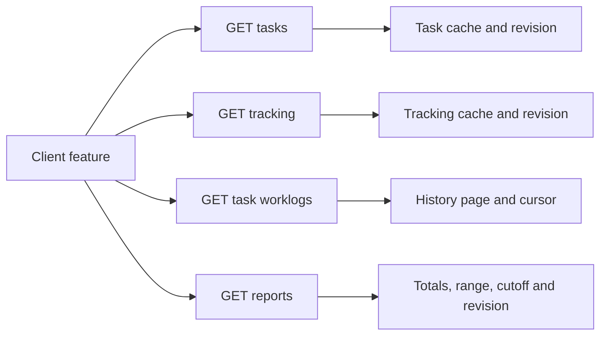

# 0016: separate HTTP resources from client refreshes

## Status

Proposed. This changes the HTTP contract, not the implemented API. No convenience endpoints are proposed for the first release.

## Date

2026-10-08

## Context

The current API combines resource reads with client refreshes. `/v1/snapshot` returns the task catalog and active tracking. Reports, global worklog pages and mutation responses include the same snapshot. Each report row also repeats its task's metadata. Task history carries global tracking and latest-work aggregates alongside individual worklogs. These contracts are defined in [tracker-protocol](../../crates/tracker-protocol/src/lib.rs).

These bundles let the existing clients refresh several views from one response. The macOS app deliberately uses reports for normal synchronization, as documented in [its daily totals behavior](../../apps/swiftui/README.md#todays-totals). A timer widget, historical reporting tool or future web UI may need a different combination. Expanding the shared bundles for each client would repeat more data and make unrelated response contracts change together.

A report remains a distinct domain query. It calculates time within a requested interval across tasks, including clipped overnight work and running worklogs. Individual history pages cannot replace that query without transferring and aggregating the worklogs. The current storage layer reads totals and tracker state in [one transaction](../../crates/tracker-storage/src/sqlite/reports.rs).

The server also has useful guarantees that must survive the split. It serializes operations, rejects stale global revisions, checks expected active or worklog values, deduplicates successful commands, and enforces transactional domain rules. [Server guards](../../crates/tracker-server/src/lib.rs), [repository contracts](../../crates/tracker-application/src/repository.rs).

## Decision

### Independent resources

Introduce a `/v2` HTTP contract. Each read returns the requested resource or calculation, together with a revision. Writes return their committed outcome, without a full task catalog or unrelated tracking state. The URI version `/v2` is separate from the protocol compatibility number, which advances from 2 to 3.

Use task IDs to connect resources. A report row refers to a task without embedding its name, archive status or timestamps. Clients resolve those fields through a task cache or task read. Resource responses do not contain a `snapshot` field, and `/v2/snapshot` does not exist.

Keep coherent internal repository reads where they protect domain behavior. Removing snapshot fields from HTTP does not require removing `TrackerSnapshot` or transaction boundaries inside Rust.

| # | Read endpoint | Response fields | Responsibility |
|---|---|---|---|
| 1 | `GET /v2/health` | `status`, `protocol_version` | Availability and protocol compatibility |
| 2 | `GET /v2/tasks` | `tasks`, `revision` | Task catalog and task activity metadata |
| 3 | `GET /v2/tasks/{id}` | `task`, `revision` | One task, including archived tasks |
| 4 | `GET /v2/tracking` | `active_worklog`, `revision` | Current global tracking, with `null` while idle |
| 5 | `GET /v2/tasks/{id}/worklogs` | `worklogs`, `next_cursor`, `revision` | One task's individual history entries |
| 6 | `GET /v2/worklogs` | `worklogs`, `next_cursor`, `revision` | Individual history entries across tasks |
| 7 | `GET /v2/worklogs/{id}` | `worklog`, `revision` | One worklog for inspection or an edit preflight |
| 8 | `GET /v2/reports` | `start`, `end`, `now`, `rows`, `total_us`, `revision` | Calculated totals for the requested interval |
| 9 | `GET /v2/tasks/inactive-preview` | `as_of`, `count`, `sample_names`, `revision` | Domain preview for bulk archive confirmation |

Successful reads return HTTP 200. Missing task or worklog IDs return HTTP 404 with the existing error envelope. The health response has no resource revision.

`GET /tasks` returns active and archived tasks by default. Optional `archived=false` or `archived=true` selects a subset; omitting the filter includes both. The first release retains the current complete catalog read. Task pagination, server-side search and conditional HTTP caching can be added when there is a concrete need.

A task has `id`, `name`, `archived`, `created_at`, `updated_at` and nullable `latest_work_start`. The last field is a domain aggregate used for recent-activity ordering, not a daily report total. Flatten it into the task representation instead of wrapping a task in `TaskItemDto`. Task-list order remains recently created, with stable identifier tie-breaking. Clients can apply the existing shared search and ordering policies to cached tasks.

Worklogs retain `id`, `task_id`, `start` and nullable `end`. Both history routes keep the existing 50-entry bound and cursor consistency checks. They return entries newest first. Preserve the current `after_start`, `after_id` and `after_revision` continuation parameters. The cursor's integer history revision is distinct from the response's opaque string server revision. An invalidated history cursor returns HTTP 409; clients restart from page one.

History entries may include a running worklog as an entry belonging to the requested collection. They do not carry a second global `active_worklog`, task aggregates or task catalog. `GET /tracking` is the authoritative read for global tracking.

Reports require `start`, `end` and `now` as RFC 3339 query parameters. The interval is half-open, and running worklogs contribute through the supplied `now`. Completed worklogs use their stored end, including when that end is later than `now`. Return the normalized parameters so the running-worklog cutoff is explicit. Rows contain only `task_id` and positive `duration_us`; `total_us` equals their sum. Include archived tasks when their worklogs contribute. An absent task row means zero time in this interval, not that the task does not exist. Durations use integer microseconds, and stored timestamp precision remains microseconds.

A report has no task metadata, active worklog or history entries. It is a calculation for a range and cutoff, not an instruction to update every client cache.

### Example response bodies

The examples describe one task at 11:00 UTC. UUIDs are illustrative. All three reads observed the same server revision. Task and tracking reads could also observe different revisions; the next section defines how clients handle that.

`GET /v2/tasks`

```json
{
  "tasks": [
    {
      "id": "019a6650-0000-7000-8000-000000000101",
      "name": "Investigate communication",
      "archived": false,
      "created_at": "2026-10-07T09:00:00Z",
      "updated_at": "2026-10-07T09:00:00Z",
      "latest_work_start": "2026-10-08T10:30:00Z"
    }
  ],
  "revision": "019a6650-0000-7000-8000-000000000106:7"
}
```

`GET /v2/tracking`

```json
{
  "active_worklog": {
    "id": "019a6650-0000-7000-8000-000000000105",
    "task_id": "019a6650-0000-7000-8000-000000000101",
    "start": "2026-10-08T10:30:00Z",
    "end": null
  },
  "revision": "019a6650-0000-7000-8000-000000000106:7"
}
```

`GET /v2/reports?start=2026-10-08T00:00:00Z&end=2026-10-09T00:00:00Z&now=2026-10-08T11:00:00Z`

```json
{
  "start": "2026-10-08T00:00:00Z",
  "end": "2026-10-09T00:00:00Z",
  "now": "2026-10-08T11:00:00Z",
  "rows": [
    {
      "task_id": "019a6650-0000-7000-8000-000000000101",
      "duration_us": 7200000000
    }
  ],
  "total_us": 7200000000,
  "revision": "019a6650-0000-7000-8000-000000000106:7"
}
```

The 2-hour total comes from 30 minutes after midnight, a completed 1-hour worklog and 30 minutes of the running worklog. The [existing response comparison](../client-server-communication.html#read-examples) shows the individual intervals and the current, larger response shapes.

### Revisions and independently cached reads

Retain the existing global revision initially. Treat it as an opaque equality token, not a timestamp or a value that clients can sort. Every read must capture its data and revision while holding the same server operation lock. The revision changes with successful commands and with uncertain server failures according to the existing guard policy. A server restart creates a new epoch.

As today, this revision describes server-mediated changes; it does not detect direct database writes. Independent endpoints do not expand that guarantee.

Each cached resource stores its own observed revision. Receiving report revision R does not make tasks or tracking cached at an older revision current. A partial read must never advance the write guard for unrelated cached data. The existing remote adapter already preserves this distinction for [task history](../../crates/tracker-remote/src/application.rs).

A client may show independently refreshed resources with explicit cached or unavailable states. When a view needs a coherent combination, compare the revisions of just those resources. If they differ, reread the resources in that combination and compare again. Limit immediate reconciliation to one retry; if state keeps changing, retain a marked cached view and retry on the next refresh. Separate reads do not promise atomic observation across requests.

For a command, collect the resources used to form its intent. Their revisions must agree before creating `expected_revision`. The server then compares that token again when executing the write, so a write between the reads and the command is still rejected. A report response alone never authorizes a command based on older task or tracking state.

Refreshing a command's inputs must preserve the user's original intent. Compare freshly read values with the ones reviewed when the action began before adopting a new guard. For example, a rename draft retains the original task name, and a tracking command retains its selected task, expected active worklog and click timestamp. Changed relevant values require review or rejection; a fresh revision must not silently authorize an old draft against a different state. Preserve the existing exact source and timestamp checks for worklog edits.

| # | Command | Reads needed to form the guarded intent |
|---|---|---|
| 1 | Create task | Task catalog revision; no existing task fields are copied |
| 2 | Rename, archive or restore | Target task and its revision; the server independently enforces active-task protection |
| 3 | Start, switch or stop | Tracking; also the target task for start or switch, at the same revision |
| 4 | Correct or delete worklog | Target worklog and its revision, retaining its exact expected values |
| 5 | Move worklog | Source worklog and destination task, at the same revision |
| 6 | Archive inactive tasks | Preview and its original revision and `as_of` |

Resource-specific versions could later reduce conflicts between unrelated writes. That is a separate concurrency change, not a prerequisite for independent response bodies. Keeping the global guard makes this proposal smaller and preserves current conflict behavior.

### Focused writes and command receipts

Keep the existing domain commands, timestamps, expected values and UUID request IDs. Use the new URI prefix and remove only the automatic full snapshot from their responses.

| # | Write endpoint | Command and result |
|---|---|---|
| 1 | `POST /v2/tasks` | Create with client-generated task ID; return the committed task |
| 2 | `PATCH /v2/tasks/{id}` | Rename, archive or restore; return the committed task |
| 3 | `PUT /v2/tracking` | Start, switch or stop; return the affected worklog or tracking outcome |
| 4 | `PATCH /v2/worklogs/{id}` | Correct or move using original expected values; return the committed worklog |
| 5 | `DELETE /v2/worklogs/{id}` | Delete an exactly matched completed worklog; return the removed worklog |
| 6 | `POST /v2/tasks/archive-inactive` | Confirm the preview; return the committed count |

Successful writes retain HTTP 200 and return a command receipt with `request_id`, `applied_revision`, `replayed` and `result`. Preserve the existing tagged domain outcome variants, including switch, already active and already idle. A result describes the command's outcome, not every current resource. `replayed` is false for the original execution and true when the idempotency cache supplies the outcome.

For example, a successful switch returns only its stopped and started worklogs, alongside the receipt metadata. Creating a task returns one task. Bulk archive returns its count; a client needing the resulting catalog explicitly reads tasks.

Task outcomes use the same task representation as reads, including `latest_work_start` observed under the command lock. A task result still describes the original command outcome if it is replayed later.

The following receipt acknowledges stopping the worklog from the read examples. It contains no task catalog or separate active-tracking field.

```json
{
  "request_id": "019a6650-0000-7000-8000-000000000107",
  "applied_revision": "019a6650-0000-7000-8000-000000000106:8",
  "replayed": false,
  "result": {
    "kind": "worklog",
    "value": {
      "id": "019a6650-0000-7000-8000-000000000105",
      "task_id": "019a6650-0000-7000-8000-000000000101",
      "start": "2026-10-08T10:30:00Z",
      "end": "2026-10-08T11:00:00Z"
    }
  }
}
```

Cache the complete original successful receipt for idempotency. An identical retry returns its original request ID, result and `applied_revision`, with `replayed: true`. Do not attach the server's current revision to an old result: another command may have changed that resource since the first attempt. Clients must not overwrite a newer resource read with a delayed receipt. After an uncertain write or an idempotent replay, reread the affected resources before claiming their current state.

The current implementation caches an original result but attaches a freshly generated snapshot on retry. Removing that snapshot requires changing the [idempotency response contract](../../crates/tracker-server/src/lib.rs), rather than simply renaming its revision field. Retain the existing 1,024-receipt memory bound and identical-byte transport retry. Restart and eviction still remove deduplication history; no durable exactly-once guarantee is introduced.

Clients may immediately apply an acknowledged result when it is still associated with their in-flight command and its unchanged pre-command cache. Mark dependent calculations and collections stale, then refresh the ones the current UI uses. Worklog changes can affect task activity ordering, history and reports, so updating one worklog must not silently label those caches current.

Preserve one active worklog, atomic switch, archived-task protection, overlap checks, exact expected worklog values, microsecond timestamps, inactive-preview expiry, structured error codes and recovery after a write that might have committed. No task-deletion or manual-worklog-creation operation is added.

### Client composition

Clients choose the resources and refresh frequency their features need. No server route is named after a sidebar, menu, terminal screen or platform.



| # | Client feature | Resources it composes |
|---|---|---|
| 1 | Timer widget | Tracking; resolve the active task through the task cache or single-task read when needed |
| 2 | Historical report | Reports and metadata for its task IDs; no tracking request is needed |
| 3 | TUI task list and timer | Tasks and tracking |
| 4 | Worklog editor | Worklog, owning task as needed, and destination task for a move |
| 5 | macOS sidebar and Today menu | Tasks, tracking and the current-day report |
| 6 | CLI | Reads required by the command; no unconditional task-and-tracking startup refresh |

The macOS client currently validates report rows against snapshot tasks and anchors projected totals to the snapshot's active worklog. Its [daily-total state](../../apps/swiftui/TrackerClient/Sources/TrackerClient/Features/DailyTotals/DailyTotalsState.swift) must change with the protocol.

Resolve report row names separately. A missing cached task means unresolved metadata until fetched; it does not invalidate otherwise valid totals. Validate row IDs, uniqueness, durations and total independently of catalog membership. Do not fabricate a task or remove a total because its metadata is temporarily unavailable.

Preserve local running-total projection only when the separately read tracking state has the same revision as the report and its active worklog matches the projection anchor. Use the report's echoed `now` as the cutoff. If revisions differ, display the last reported totals without extrapolating until a coherent pair arrives. The timer itself may continue displaying the independently confirmed tracking state. For atomic presentation of names, totals and active tracking, the client must also match the task revision before publishing that combination.

A client refresh API may still compose several HTTP calls and produce an internal view model. That composition belongs in the client adapter, not in every generic HTTP response. Local-mode clients can retain their existing Rust application calls and coherent internal models.

### Convenience endpoints

Add none initially. First migrate the clients and measure request count, response bytes, latency and behavior during concurrent writes. More routes alone do not guarantee a performance improvement: independent reads may use more round trips than the current bundles.

If a measured workflow benefits from a combined read, add an explicitly documented aggregate endpoint alongside the generic resources. Its contract must identify the included resources and their common revision. A hypothetical `GET /v2/overview` could combine tasks and tracking without calling the bundle a snapshot. That route is not part of this proposal's first release. A platform-specific aggregate is only justified by demonstrated requirements that the generic resources cannot serve adequately.

### Migration and acceptance criteria

Keep `/v1` behavior intact while introducing `/v2`. Both versions must use the same server core, operation lock, database and guarded write history. Namespace idempotency fingerprints by API version so request IDs cannot be reused ambiguously across contracts.

Serve protocol number 2 from `/v1/health` and 3 from `/v2/health`. Existing clients check `/v1/health`; new clients explicitly check `/v2/health` and select the `/v2` DTOs. The current client requires an exact protocol number and strict JSON decoding, so silently replacing `/v1` response fields would break it. [Current health and decoding](../../crates/tracker-remote/src/application.rs), [protocol definitions](../../crates/tracker-protocol/src/lib.rs).

Implementation proceeds in these steps:

1. Add `/v2` read DTOs and handlers with independent data and correctly captured revisions. Add single-task and single-worklog reads. Retain domain calculations and transactions.
2. Add focused mutation receipts and cache original receipt revisions. Preserve existing command validation and retry behavior.
3. Split the remote adapter's caches and read methods. Startup health checks no longer imply fetching every resource. Replace full-snapshot recovery with explicit recovery of affected resources.
4. Migrate the CLI and TUI, then the Swift bridge and portable session. Update caches, guarded preflights, report validation and projection together. In-process bridge JSON need not mirror the HTTP envelope.
5. Update the architecture diagrams, method tables and communication examples to distinguish implemented `/v2` behavior from historical `/v1` behavior. Retire `/v1` only after the supported clients have migrated; decide the removal release separately.

Acceptance must demonstrate narrow read and write response schemas, unchanged aggregation and domain rules, bounded history, stale-write rejection, delayed receipts, replay after intervening writes, restart recovery and mixed-version access to the same core. Include the stop-then-archive race from this discussion and mismatched report/tracking revisions during local projection.

Existing end-to-end tests stay unchanged during this proposal. Before implementation modifies E2E tests for the new observable protocol or client behavior, obtain the explicit consent required by the repository. New implementation tests must verify behavior and concurrency outcomes rather than merely repeat DTO construction.

If accepted, this decision replaces three expectations for remote clients. ADR [0004](0004-paginated-worklog-history.md) describes history reads implicitly refreshing tracking. ADR [0005](0005-worklog-correction.md) describes coherent task-and-tracking recovery and history page-adoption metadata. ADR [0008](0008-move-worklogs-between-tasks.md) describes move outcomes returning source and destination activity aggregates. The new HTTP contract uses explicit resource reads and client cache coordination for those cases. Their domain rules, coherent repository reads and local-mode behavior remain. ADR [0013](0013-remove-remote-archive-candidate-fingerprints.md) remains applicable to archive preview guards and protocol incompatibility. Accepted ADR statuses are not changed while this proposal is pending.

## Consequences

The HTTP API describes tasks, tracking, worklogs and calculations directly. A reports response no longer carries unrelated task and tracking state, and a mutation receipt no longer carries the complete catalog. Future clients can select their own combinations without expanding every shared response.

Clients take responsibility for cache freshness and coherent combinations. Some screens require more requests. Global revision conflicts remain conservative, and a frequently changing server can delay obtaining matching read revisions. The proposal preserves domain correctness at write time while allowing independent reads for features that tolerate brief stale presentation.

This does not eliminate all repeated bytes. A task collection contains task resources; worklog history and tracking can both contain the same running worklog. Such overlap follows the requested resource semantics. Automatic catalog and global-tracking attachments to unrelated responses are removed.

The first implementation adds no resource-version database migration, task pagination, push subscription, convenience endpoint or performance claim. Those can be evaluated separately without restoring mandatory UI refresh bundles.

Source basis: production code and existing client documentation at revision `74f465d`, inspected on 8 October 2026. The linked communication page describes the current API, not this proposal.

| # | Proposed change | Result |
|---|---|---|
| 1 | Replace snapshot reads with tasks and tracking | Explicit resource names and independent refreshes |
| 2 | Reports return task IDs and durations | Calculated totals without a catalog or tracking attachment |
| 3 | History returns entries and continuation metadata | No automatic global timer refresh |
| 4 | Writes return original command receipts | Narrow outcomes with correct idempotency semantics |
| 5 | Track revisions per resource cache | Partial reads cannot authorize stale client intent |
| 6 | Defer convenience endpoints | Add combined reads only after measuring a need |
