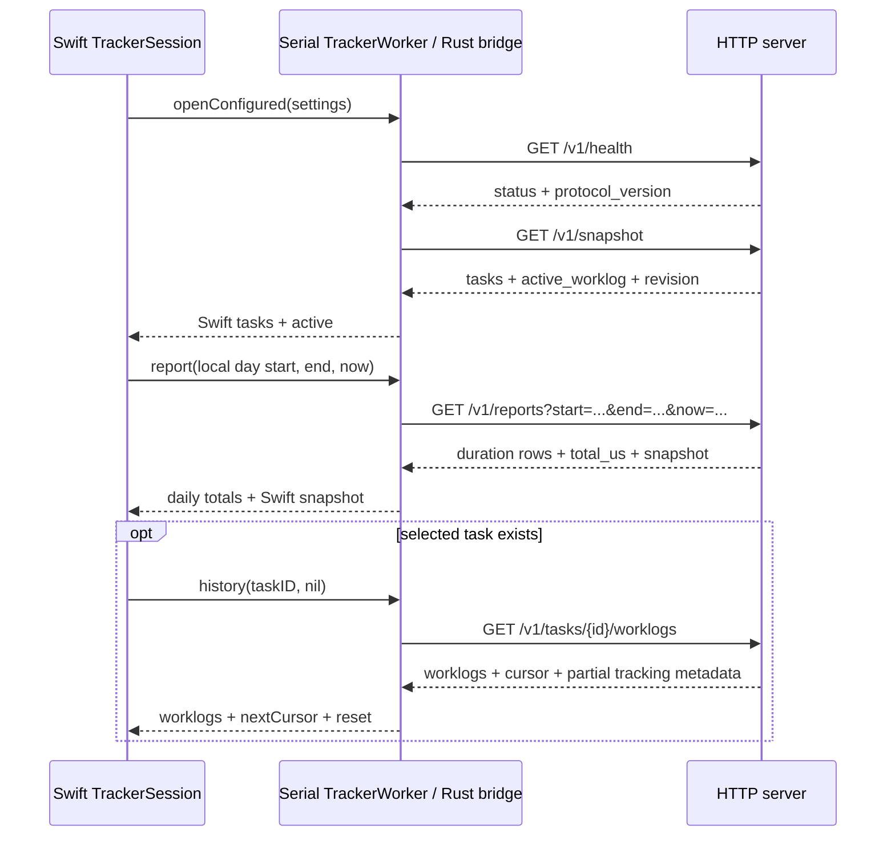
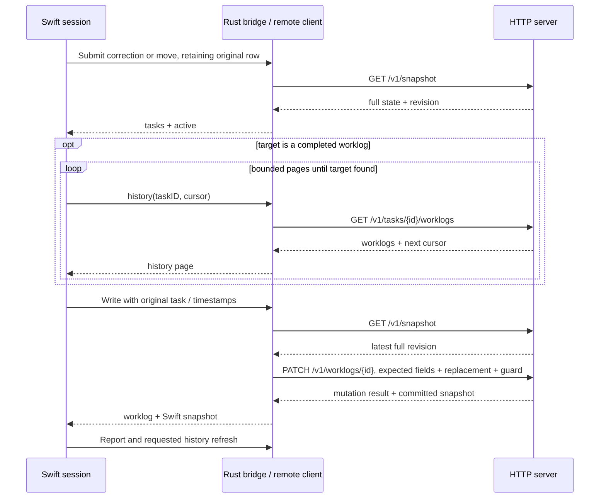

# Swift client communication

Source snapshot: 2026-10-08, revision `3806193`. These notes describe the macOS app in server mode. Local mode uses the same Swift session and Rust bridge against SQLite.

The app constructs `TrackerSession` with one `TrackerWorker` as both `TrackerClient` and `ReportClient`. The worker runs all bridge operations on one serial utility queue. Opening a remote Rust handle creates a disconnected cached client; opening the handle alone sends no request. The worker then calls the C ABI `tt_bridge_snapshot(handle, true)`, which refreshes the remote client before converting its cached tasks and active worklog to Swift JSON. The C ABI envelope and camelCase fields are separate from the HTTP protocol. [App composition](../apps/swiftui/Sources/TimeTrackerSwiftUI/App/TrackerStore.swift), [worker](../apps/swiftui/Sources/TimeTrackerSwiftUI/Infrastructure/RustBridge/TrackerWorker.swift), [bridge snapshot](../apps/swiftui/bridge/src/lib.rs), [remote construction and refresh](../crates/tracker-remote/src/application.rs).

The health check precedes a refresh until that handle completes its first successful snapshot read. Later snapshot refreshes skip health. A failed initial attempt can therefore repeat both requests. Connection testing uses a temporary handle. Changing connections installs the candidate handle only after its snapshot succeeds. A saved server connection whose initial read fails stays in server mode. [Remote refresh](../crates/tracker-remote/src/application.rs), [connection worker](../apps/swiftui/Sources/TimeTrackerSwiftUI/Infrastructure/RustBridge/TrackerWorker.swift).

Once connected, the installed app refreshes through `GET /v1/reports`, because the report response includes a full authoritative snapshot. Startup and recovery while unconfirmed or stale use `GET /v1/snapshot`; accepting that snapshot queues a report. Request bounds cover the current day in the user's calendar and time zone, and `now` is captured before the request. The report returns microsecond durations, which the client projects locally between reads. [Refresh and report orchestration](../apps/swiftui/TrackerClient/Sources/TrackerClient/App/TrackerSession.swift), [day bounds and projection](../apps/swiftui/TrackerClient/Sources/TrackerClient/Features/DailyTotals/DailyTotalsState.swift), [report wire request](../crates/tracker-remote/src/application.rs).

The session schedules a one-shot poll after pending operations finish. A visible main window or open menu uses 5 seconds; a hidden app uses 60 seconds. Consecutive failures give visible polling delays of 5, 10, 20, 40, then 60 seconds. Hidden polling stays at 60 seconds. Scheduler tolerance is `min(5, interval * 0.2)`, so these are scheduling targets, not strict wall-clock periods. Sleep cancels timers. Wake refreshes after any pending editor or automation work. Opening the first visible UI, manual refresh, and local midnight also request refresh. Multiple refresh requests while busy collapse into one pending refresh. [Polling policy](../apps/swiftui/TrackerClient/Sources/TrackerClient/Features/Connection/ConnectionState.swift), [session timers and queue](../apps/swiftui/TrackerClient/Sources/TrackerClient/App/TrackerSession.swift), [macOS lifecycle](../apps/swiftui/Sources/TimeTrackerSwiftUI/Infrastructure/MacLifecycle/MacLifecycleObserver.swift).

The one-second timer updates the visible running timer locally. It does not send a request on each tick. A day change detected by that timer can request a report, alongside the dedicated midnight timer. Protocol failures stop scheduled polling; explicit refresh, becoming visible, or waking can clear the protocol block and retry. [Display timer and retry gates](../apps/swiftui/TrackerClient/Sources/TrackerClient/App/TrackerSession.swift), [connection failure state](../apps/swiftui/TrackerClient/Sources/TrackerClient/Features/Connection/ConnectionState.swift).

Task selection, tab changes, retrying history, and selected-task aggregate or active-worklog changes request the first history page. Loading older entries supplies the opaque cursor, which Rust expands into `after_start`, `after_id`, and `after_revision`. A history revision conflict makes the bridge reread page one and return `reset: true`. History responses update part of Rust's cache but do not advance its full-snapshot write revision. Swift receives worklogs and cursor only, so history cannot confirm the displayed timer for a queued tracking command. [Catalog change detection](../apps/swiftui/TrackerClient/Sources/TrackerClient/Features/TaskCatalog/TaskCatalogState.swift), [session history requests](../apps/swiftui/TrackerClient/Sources/TrackerClient/App/TrackerSession.swift), [history bridge](../apps/swiftui/bridge/src/lib.rs), [history HTTP request and cache](../crates/tracker-remote/src/application.rs).

Successful writes return their result and full snapshot. The bridge converts that cached committed snapshot to Swift JSON without another snapshot request. Accepting it invalidates daily totals, so the session usually follows with a report and any needed selected-task history read. Every remote mutation includes a guard with the cached full-snapshot revision and a UUID request ID. [Mutation handling and guards](../crates/tracker-remote/src/application.rs), [bridge write responses](../apps/swiftui/bridge/src/lib.rs), [snapshot acceptance](../apps/swiftui/TrackerClient/Sources/TrackerClient/App/TrackerSession.swift).

Preflight reads differ by action. Create refreshes only when the connection is unconfirmed or stale. Rename, archive, and unarchive always refresh before comparing the user's intent with current task state. Start and stop usually write against the rendered cached state; a queued command adds a snapshot if the preceding operation did not deliver one. Start carries the expected active ID, stop targets the expected worklog ID, and both preserve the click timestamp. [Creation, task editing, and tracking orchestration](../apps/swiftui/TrackerClient/Sources/TrackerClient/App/TrackerSession.swift), [tracking requests](../crates/tracker-remote/src/application.rs).

Correction and move always refresh in Swift, then read bounded history pages if the target is not the active worklog. The Rust backend performs another snapshot refresh immediately before the PATCH, preserving the editor's original expected timestamps and source task. Opening or retrying the move picker refreshes its task catalog; typing a destination query searches the cached catalog without a separate HTTP search request. [Worklog orchestration](../apps/swiftui/TrackerClient/Sources/TrackerClient/App/TrackerSession.swift), [move picker state](../apps/swiftui/TrackerClient/Sources/TrackerClient/Features/WorklogMove/WorklogMoveState.swift), [backend correction, move, and candidates](../apps/swiftui/bridge/src/backend.rs).

Optional screen-lock automation refreshes before writing. Lock pauses only the expected active worklog with `PUT /v1/tracking`; unlock resumes only if tracking remains idle and the task remains available. Sleep stops scheduled reads but does not itself issue a stop command. [Screen events](../apps/swiftui/Sources/TimeTrackerSwiftUI/Infrastructure/MacLifecycle/MacLifecycleObserver.swift), [automation and sleep handling](../apps/swiftui/TrackerClient/Sources/TrackerClient/App/TrackerSession.swift), [pause and resume bridge](../apps/swiftui/bridge/src/lib.rs).

A failed mutation can have committed before its response was lost. Rust performs an automatic snapshot refresh on HTTP errors, then still returns the original operation failure. Transport failures do not take that Rust recovery path. Swift adds a reconciliation snapshot after attempted tracking writes and applicable editor failures. Correction and move can also reread history to establish whether the intended change already happened. Reads can therefore occur twice during recovery. The bridge blocks later ordinary writes until an authoritative refresh clears `requires_refresh`. [Remote error recovery](../crates/tracker-remote/src/application.rs), [Swift reconciliation](../apps/swiftui/TrackerClient/Sources/TrackerClient/App/TrackerSession.swift), [bridge write gate](../apps/swiftui/bridge/src/backend.rs).

| # | Trigger | HTTP traffic in server mode |
|---|---|---|
| 1 | Open, test, or connect a new handle | Health, then snapshot; normal startup follows with report and selected history |
| 2 | Healthy periodic refresh | Report with local day bounds and captured cutoff; selected history when aggregate state changes |
| 3 | Unconfirmed or stale refresh | Snapshot, then report after successful recovery |
| 4 | UI becomes visible, wake, manual refresh, midnight | Same refresh selection as rows 2 and 3, serialized with pending work |
| 5 | Display tick | Local update, with refresh only when the day changes |
| 6 | Select task, change tab, retry history, load older | Task worklog page, with cursor query fields for older entries |
| 7 | Create, rename, archive, start, or stop | Action-specific preflight, guarded mutation, then report and required history |
| 8 | Correct or move worklog | Snapshot, bounded history if needed, another backend snapshot, guarded PATCH, report and history |
| 9 | Move destination search | Snapshot on open or retry; subsequent query edits use cached tasks |
| 10 | Screen lock or unlock with automation enabled | Snapshot, then conditional tracking PUT, followed by report and required history |
| 11 | Write failure | Rust snapshot for HTTP errors, Swift reconciliation snapshot where required, possibly history verification |
